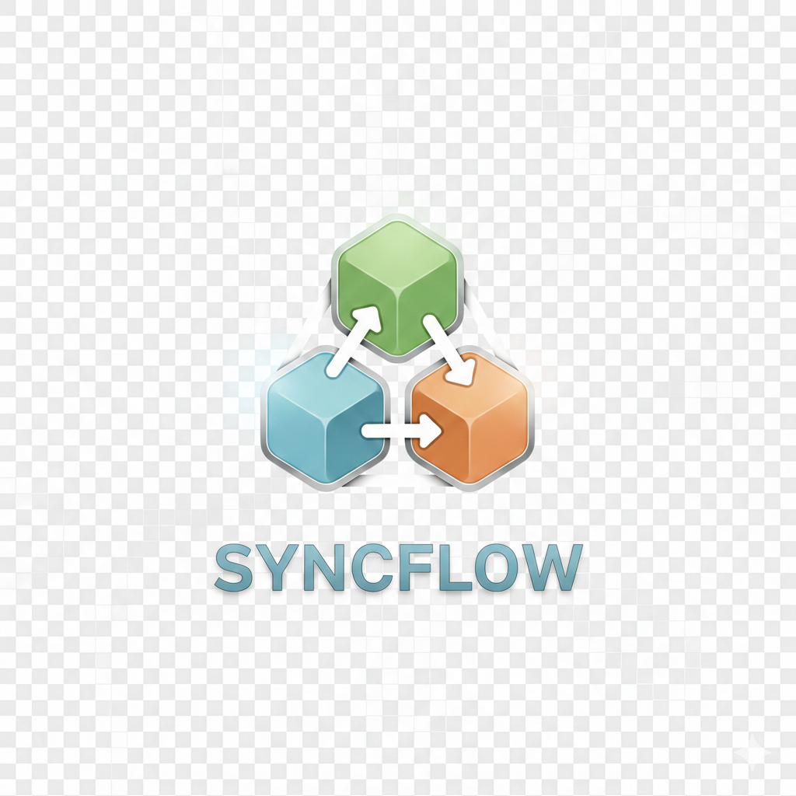

<p align="center">
  
</p>

<h1 align="center">SyncFlow</h1>

<p align="center">
  Fast, secure file sharing with end-to-end encryption and seamless device transfers.
</p>

<p align="center">
  
  
  
  
</p>

---

## Features

- **Instant File Sharing** — Upload and get a shareable link in seconds
- **End-to-End Encryption** — AES-256-GCM encryption, key never leaves your browser
- **Phone to PC Transfer** — Scan QR code to send files from phone to computer
- **QR Code Sharing** — Generate QR codes for easy mobile sharing
- **Expiring Links** — Set links to expire after 1 hour, 24 hours, 7 days, or 30 days
- **Download Limits** — Self-destructing files after N downloads
- **Progress Tracking** — Real-time upload progress with encryption status
- **No Account Required** — Anonymous uploads supported
- **Magic Link Auth** — Passwordless sign-in via email

## Quick Start

### Prerequisites

- Node.js 18+
- A [Supabase](https://supabase.com) account (free tier works)

### 1. Clone the repository

```bash
git clone https://github.com/yourusername/syncflow.git
cd syncflow
```

### 2. Install dependencies

```bash
npm install
```

### 3. Set up Supabase

1. Create a new project at [supabase.com](https://supabase.com)
2. Go to **Settings** → **API** and copy your credentials
3. Create a storage bucket named `file-transfer-bucket` (set to **private**)

### 4. Configure environment variables

```bash
cp .env.example .env.local
```

Edit `.env.local` with your Supabase credentials:

```env
NEXT_PUBLIC_SUPABASE_URL=https://your-project.supabase.co
NEXT_PUBLIC_SUPABASE_ANON_KEY=your-anon-key
SUPABASE_SERVICE_ROLE_KEY=your-service-role-key
STORAGE_BUCKET=file-transfer-bucket
```

### 5. Run database migrations

In the Supabase SQL Editor, run these migrations in order:

<details>
<summary><strong>1. Initial schema</strong> (click to expand)</summary>

```sql
-- Files metadata table
CREATE TABLE files (
  id UUID PRIMARY KEY DEFAULT gen_random_uuid(),
  token VARCHAR(32) UNIQUE NOT NULL,
  file_path TEXT NOT NULL,
  original_name TEXT NOT NULL,
  size BIGINT NOT NULL,
  mime_type TEXT NOT NULL,
  owner_id UUID REFERENCES auth.users(id) ON DELETE SET NULL,
  created_at TIMESTAMPTZ DEFAULT NOW()
);

-- Enable RLS
ALTER TABLE files ENABLE ROW LEVEL SECURITY;

-- Policies
CREATE POLICY "Anyone can insert files" ON files FOR INSERT WITH CHECK (true);
CREATE POLICY "Anyone can read files" ON files FOR SELECT USING (true);
CREATE POLICY "Owners can delete files" ON files FOR DELETE USING (auth.uid() = owner_id);
```

</details>

<details>
<summary><strong>2. Encryption & Expiry</strong> (click to expand)</summary>

```sql
-- Add encryption, expiry, and download tracking
ALTER TABLE files
ADD COLUMN IF NOT EXISTS is_encrypted BOOLEAN DEFAULT FALSE,
ADD COLUMN IF NOT EXISTS expires_at TIMESTAMPTZ DEFAULT NULL,
ADD COLUMN IF NOT EXISTS max_downloads INTEGER DEFAULT NULL,
ADD COLUMN IF NOT EXISTS download_count INTEGER DEFAULT 0;

CREATE INDEX IF NOT EXISTS idx_files_expires_at ON files(expires_at) WHERE expires_at IS NOT NULL;

CREATE OR REPLACE FUNCTION increment_download_count(file_token VARCHAR(32))
RETURNS INTEGER AS $$
DECLARE new_count INTEGER;
BEGIN
  UPDATE files SET download_count = download_count + 1
  WHERE token = file_token
  RETURNING download_count INTO new_count;
  RETURN new_count;
END;
$$ LANGUAGE plpgsql;
```

</details>

<details>
<summary><strong>3. Phone to PC Transfer</strong> (click to expand)</summary>

```sql
-- Receive sessions for phone-to-PC transfers
CREATE TABLE IF NOT EXISTS receive_sessions (
  id UUID PRIMARY KEY DEFAULT gen_random_uuid(),
  session_token VARCHAR(32) UNIQUE NOT NULL,
  file_token VARCHAR(32) DEFAULT NULL,
  created_at TIMESTAMPTZ DEFAULT NOW(),
  expires_at TIMESTAMPTZ DEFAULT (NOW() + INTERVAL '10 minutes')
);

CREATE INDEX IF NOT EXISTS idx_receive_sessions_token ON receive_sessions(session_token);
CREATE INDEX IF NOT EXISTS idx_receive_sessions_expires ON receive_sessions(expires_at);

ALTER TABLE receive_sessions ENABLE ROW LEVEL SECURITY;

CREATE POLICY "Anyone can create receive sessions" ON receive_sessions FOR INSERT WITH CHECK (true);
CREATE POLICY "Anyone can read receive sessions" ON receive_sessions FOR SELECT USING (true);
CREATE POLICY "Anyone can update receive sessions" ON receive_sessions FOR UPDATE USING (true);
```

</details>

### 6. Start the development server

```bash
npm run dev
```

Open [http://localhost:3000](http://localhost:3000)

## Usage

### Upload a File

1. Drag and drop a file or click to browse
2. (Optional) Enable encryption, set expiry, or download limit
3. Click **Upload & Share**
4. Copy the link or share via QR code

### Receive from Phone

1. Click **Receive** on the home page
2. Scan the QR code with your phone
3. Select a file on your phone
4. File appears on your PC automatically

### Manage Files

1. Sign in with your email (magic link)
2. View all your uploads in the dashboard
3. Copy links or delete files

## Project Structure

```
src/
├── app/                    # Next.js App Router
│   ├── api/                # API routes
│   │   ├── upload/         # File upload endpoint
│   │   ├── receive/        # Receive session endpoints
│   │   └── send/           # Phone upload endpoint
│   ├── dashboard/          # User's files
│   ├── login/              # Magic link login
│   ├── receive/            # QR code for receiving
│   ├── send/[sessionToken] # Mobile upload page
│   └── share/[token]/      # Download page
├── components/             # React components
├── actions/                # Server Actions
├── lib/                    # Utilities
│   ├── crypto.ts           # Encryption (AES-256-GCM)
│   ├── supabase/           # Supabase clients
│   └── utils.ts            # Helpers
└── types/                  # TypeScript types
```

## Tech Stack

| Technology | Purpose |
|------------|---------|
| [Next.js 16](https://nextjs.org/) | React framework |
| [TypeScript](https://www.typescriptlang.org/) | Type safety |
| [Supabase](https://supabase.com) | Auth, Storage, Database |
| [Tailwind CSS](https://tailwindcss.com/) | Styling |
| Web Crypto API | AES-256-GCM encryption |
| [qrcode.react](https://npmjs.com/package/qrcode.react) | QR code generation |

## Security

| Feature | Description |
|---------|-------------|
| Private Storage | Files stored in private Supabase bucket |
| Signed URLs | Download links expire after 1 hour |
| E2E Encryption | Keys stored in URL fragment, never sent to server |
| Row Level Security | Database-level access control |
| CSRF Protection | Built into Next.js Server Actions |

## Environment Variables

| Variable | Required | Description |
|----------|----------|-------------|
| `NEXT_PUBLIC_SUPABASE_URL` | Yes | Supabase project URL |
| `NEXT_PUBLIC_SUPABASE_ANON_KEY` | Yes | Supabase anonymous key |
| `SUPABASE_SERVICE_ROLE_KEY` | Yes | Supabase service role key |
| `STORAGE_BUCKET` | Yes | Storage bucket name |
| `NEXT_PUBLIC_APP_URL` | No | Production URL for share links |

## Scripts

```bash
npm run dev      # Start development server
npm run build    # Production build
npm run start    # Start production server
npm run lint     # Run ESLint
```

## Deployment

### Vercel (Recommended)

1. Push to GitHub
2. Import project in [Vercel](https://vercel.com)
3. Add environment variables
4. Deploy

### Other Platforms

```bash
npm run build
npm start
```

## Contributing

Contributions are welcome! Please open an issue or submit a PR.

## License

MIT

---

<p align="center">
  Built with <a href="https://nextjs.org">Next.js</a> and <a href="https://supabase.com">Supabase</a>
</p>
